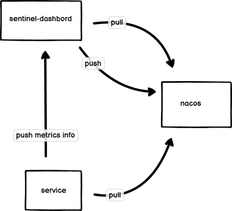

# Sentinel-NACOS 控制台

## 1. 改造思路、问题及解决方案



改造 Sentinel 控制台，将规则由sentinel推送到各个服务端点改成持久化到 Nacos 中。

#### Q1: 改造是否改动前后端代码？
  本次改造涉及前端代码，后端部分代码
#### Q2: 针对不同服务项目，且命名空间不同如何完成Nacos配置发布和订阅？
  查过官方文档【https://nacos.io/blog/faq/nacos-user-question-history8193/ 】了解，nacos不支持多namespace客户端访问，解决方案可通过构建多客户端解决订阅和发布问题  
#### Q3: 如何完成多客户端的动态新增？
  新增Nacos配置文件[sentinel-datasource-config.yaml]详细查看【 com.alibaba.csp.sentinel.dashboard.datasource.nacos.NacosConfigClientProvider 】，通过nacos动态配置，完成多服务端项目接入Nacos，且有不同命名空间情况下，构建租户隔离客户端来发布和拉取配置使用
#### Q4: 增加了什么功能？
 
- 增加NACOS持久化，项目目录在【com.alibaba.csp.sentinel.dashboard.rule.nacos】，支持多命名空间接入，方便不同项目开发接入
- 新增.*通配符的正则判定，支持授权规则、流控规则、热点规则，详细查看【com.alibaba.csp.sentinel.dashboard.util.RegexRuleUtil】
- 新增 mse（nacos企业版）接入，【com.alibaba.csp.sentinel.dashboard.rule.nacos.SentinelNacosSourceProperties.AppSource#instanceId】字段是对mse支持，如果是使用开源nacos版本，请忽略该字段，mse接入如果是需要有写入权限，通用版本nacos不适用，需要阿里云的SDK接入配置后才能发布配置


## 2. 接入规则
### 2.1 sentinel-dashboard配置
```
2.1.1 dashborad 工程增加nacos配置，读取group默认SENTINEL_GROUP，可自行改动，详细配置查看【com.alibaba.csp.sentinel.dashboard.rule.nacos.NacosProperties】

sentinel.nacos.server-addr=xxx
sentinel.nacos.username=xxx
sentinel.nacos.password=xxxx
sentinel.nacos.namespace=xxxxx

2.1.2在nacos对应的命名空间和group下新增sentinel-datasource-config.yaml配置文件，详细配置查看【com.alibaba.csp.sentinel.dashboard.rule.nacos.SentinelNacosSourceProperties】
  # 配置规则类型，对应值如下：
    sentinel-service:
       mseEnabled: false #默认不启用mse（nacos企业版），如果开启默认是使用mse客户端接入
       source:
         - name: {appName} # 接入端应用的服务名称
           namespace: {namespace}  # 接入端应用的Nacos命名空间
           instanceId：{instanceId} # 接入端应用的Nacos的instanceId空间（mse特定配置）
           accessKey： {accessKey} # 接入端应用的Nacos accessKey空间
           secretKey： {secretKey} # 接入端应用的Nacos secretKey空间
           username：  {username} # 接入端应用的Nacos username空间
           password：  {password} # 接入端应用的Nacos password空间
         ....  
```
###  2.2 服务端配置文件取以下规则配置
```
2.2.1 服务端配置文件取以下规则配置

   GROUP = 'SENTINEL_GROUP'
   flow 命名规则 ：{服务名}-flow-rules
   gw 命名规则 ：{服务名}-gw-flow-rules
   system 命名规则 ：{服务名}-system-rules
   authority 命名规则 ：{服务名}-authority-rules
   degrade 命名规则 ：{服务名}-degrade-rules
   param flow 命名规则 ：{服务名}-param-rules
   
详细可以参考 com.alibaba.csp.sentinel.dashboard.rule.nacos.NacosConfigUtil
   
2.2.2 客户端文件示例

spring:
  cloud:
    sentinel:
      datasource:
        flow-rules:
          nacos:
            group-id: SENTINEL_GROUP
            rule-type: flow
            data-id: ${spring.application.name}-flow-rules
            server-addr: ${spring.cloud.nacos.config.server-addr}
            namespace: ${spring.cloud.nacos.config.namespace}
            access-key: ${spring.cloud.nacos.config.access-key}
            secret-key: ${spring.cloud.nacos.config.secret-key}
            username: ${spring.cloud.nacos.config.username}
            password: ${spring.cloud.nacos.config.password}

```
## 3. 官方文档入口
[Sentinel官方文档](./Sentinel-README.md)
